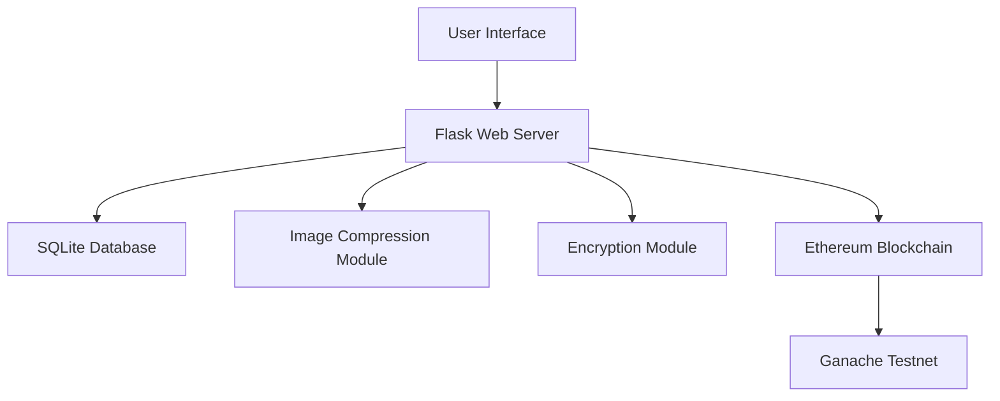

# Project Summary: Election Fraud Checker Using AI/ML and Blockchain

## Project Overview

This project implements a secure electronic voting system that combines web technologies with blockchain to ensure transparency and prevent election fraud. The system allows users to authenticate using their name and government ID, cast votes for political parties, and stores these votes on an Ethereum blockchain.

## Completed Architectural Work

### 1. Project Documentation
- **README.md**: High-level project overview, features, and architecture
- **IMPLEMENTATION_PLAN.md**: Detailed step-by-step implementation plan
- **TECHNICAL_SPECIFICATION.md**: Comprehensive technical specifications including code examples
- **SETUP_GUIDE.md**: Complete setup and deployment instructions

### 2. Technology Stack
- **Backend**: Flask (Python web framework)
- **Database**: SQLite for local development
- **Blockchain**: Ethereum with Web3.py integration
- **Smart Contracts**: Solidity for vote recording
- **Security**: PyCryptodome for vote encryption, Pillow for image compression
- **Frontend**: HTML/CSS/JavaScript (plain, no frameworks)

### 3. System Architecture
The system follows a modular architecture with clearly defined components:

### 4. Database Design
Three main tables have been designed:
- **Users Table**: Stores user registration information and ID image paths
- **Parties Table**: Contains political party information
- **Votes Table**: Records encrypted votes with blockchain transaction hashes

### 5. Security Features
- Government ID image compression to reduce storage requirements
- AES encryption for vote data using PyCryptodome
- Blockchain immutability for vote verification
- Separation of personal information from vote data

## Next Steps for Implementation

To implement this system, the following phases should be executed:

### Phase 1: Core Flask Application
1. Set up Flask application structure with proper routing
2. Implement database models using SQLAlchemy
3. Create configuration management

### Phase 2: Authentication System
1. Implement user registration with name input
2. Create ID image upload functionality
3. Add image compression using Pillow

### Phase 3: Voting System
1. Create vote submission interface
2. Implement vote encryption using PyCryptodome
3. Add vote storage in database

### Phase 4: Blockchain Integration
1. Develop Solidity smart contract for vote recording
2. Integrate Web3.py for Ethereum interactions
3. Implement vote submission to blockchain

### Phase 5: Frontend Development
1. Create HTML templates for all pages
2. Add CSS styling for responsive design
3. Implement JavaScript functionality for dynamic UI

### Phase 6: Testing and Deployment
1. Conduct unit and integration testing
2. Perform security auditing
3. Create deployment packages
4. Document usage procedures

## Key Implementation Details

### Smart Contract Functionality
The Ethereum smart contract will provide:
- Vote recording with user and party identification
- Duplicate vote prevention
- Event logging for vote tracking
- Vote verification mechanisms

### Web3.py Integration
The system will use Web3.py to:
- Connect to Ganache testnet for development
- Deploy smart contracts
- Submit votes to the blockchain
- Verify transaction confirmations

### Security Measures
- All votes are encrypted before database storage
- Government ID images are compressed but not stored on blockchain
- User authentication prevents unauthorized voting
- Blockchain ensures vote immutability

## Deployment Considerations

### Development Environment
- Python 3.8+
- Ganache for local blockchain testing
- SQLite for database
- Virtual environment for package isolation

### Production Considerations
- PostgreSQL instead of SQLite for scalability
- Public Ethereum testnet or mainnet deployment
- HTTPS for secure communication
- Load balancing for high availability

## Conclusion

The architectural foundation for the Election Fraud Checker system has been successfully established. The comprehensive documentation provides a clear roadmap for implementation, with detailed technical specifications and code examples to guide developers through each phase of development.

The modular design ensures that components can be developed and tested independently, while the blockchain integration provides the security and transparency necessary for a voting system.