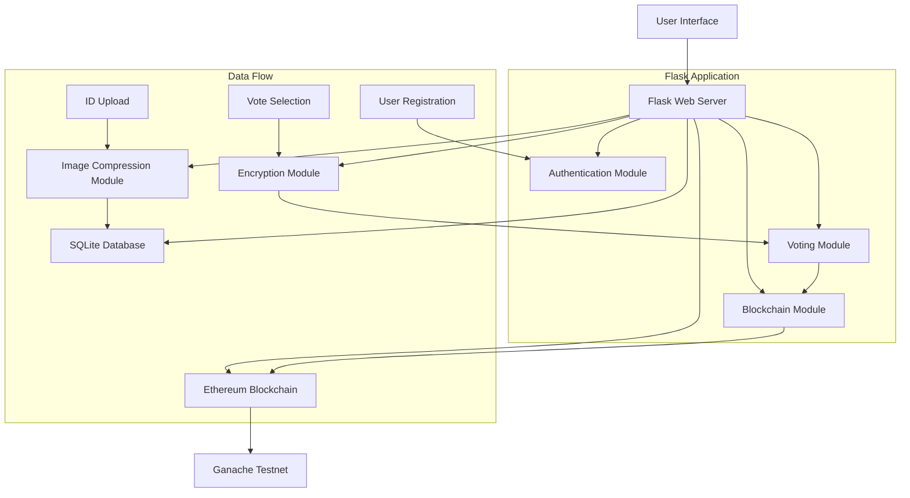

# Election Fraud Checker Using AI/ML and Blockchain

## Project Overview
This is a vote ballot system website built with Flask that allows users to securely cast votes which are then recorded on an Ethereum blockchain. The system includes user authentication with government ID verification, vote encryption, and blockchain integration to prevent election fraud.

## Key Features
- User authentication with name and government ID upload
- Image compression for ID storage
- Secure vote encryption using PyCryptodome
- Ethereum blockchain integration using Web3.py
- Local development using Ganache testnet
- SQLite database for user and vote storage

## Technology Stack
- **Backend**: Flask (Python)
- **Blockchain**: Ethereum with Web3.py
- **Database**: SQLite
- **Encryption**: PyCryptodome
- **Frontend**: HTML/CSS/JavaScript
- **Blockchain Testing**: Ganache

## System Architecture


## Project Structure
```
election-system/
├── app/
│   ├── __init__.py
│   ├── models.py
│   ├── routes.py
│   ├── blockchain/
│   │   ├── __init__.py
│   │   ├── contract.py
│   │   └── web3_integration.py
│   ├── auth/
│   │   ├── __init__.py
│   │   └── authentication.py
│   ├── voting/
│   │   ├── __init__.py
│   │   └── vote_processing.py
│   └── utils/
│       ├── __init__.py
│       ├── image_compression.py
│       └── encryption.py
├── templates/
│   ├── base.html
│   ├── login.html
│   ├── vote.html
│   └── results.html
├── static/
│   ├── css/
│   ├── js/
│   └── images/
├── migrations/
├── tests/
├── config.py
├── requirements.txt
└── run.py
```

## Requirements
```
Flask==2.3.2
web3==6.0.0
Pillow==9.5.0
pycryptodome==3.18.0
SQLAlchemy==2.0.15
Flask-SQLAlchemy==3.0.3
python-dotenv==1.0.0
```

## Workflow
1. User registers with name and uploads government ID
2. ID is compressed and stored in database
3. User selects party to vote for
4. Vote is encrypted before storage
5. Vote is recorded on Ethereum blockchain
6. All ballot systems synchronize through blockchain

## Database Schema
- **Users Table**: id, name, id_image_path, registered_at
- **Votes Table**: id, user_id, encrypted_vote, blockchain_tx_hash, voted_at
- **Parties Table**: id, name, description

## Blockchain Integration
- Smart contract for vote recording
- Web3.py integration for Ethereum interactions
- Transaction hashing for vote verification
- Event logging for vote tracking
