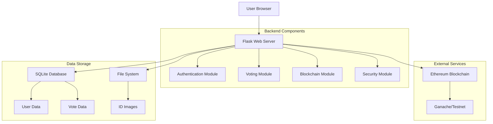

# Technical Specification for Vote Ballot System

## 1. System Overview

### 1.1 Purpose
The Vote Ballot System is a secure electronic voting platform that leverages blockchain technology to ensure transparency and prevent election fraud. The system allows users to authenticate using their name and government ID, cast votes for political parties, and stores these votes on an Ethereum blockchain.

### 1.2 Key Components
1. **Web Application**: Flask-based frontend and backend
2. **Database**: SQLite for user and vote storage
3. **Blockchain**: Ethereum smart contract for vote recording
4. **Security**: Image compression, vote encryption, and authentication

## 2. Architecture

### 2.1 High-Level Architecture


### 2.2 Data Flow
1. User accesses the web interface
2. User registers with name and uploads ID
3. System compresses ID image and stores it
4. User selects a party to vote for
5. System encrypts the vote
6. Vote is stored in database
7. Vote hash is submitted to blockchain
8. Transaction confirmation is stored

## 3. Database Design

### 3.1 Users Table
```sql
CREATE TABLE users (
    id INTEGER PRIMARY KEY AUTOINCREMENT,
    name TEXT NOT NULL,
    id_image_path TEXT NOT NULL,
    registered_at TIMESTAMP DEFAULT CURRENT_TIMESTAMP
);
```

### 3.2 Parties Table
```sql
CREATE TABLE parties (
    id INTEGER PRIMARY KEY AUTOINCREMENT,
    name TEXT NOT NULL UNIQUE,
    description TEXT
);
```

### 3.3 Votes Table
```sql
CREATE TABLE votes (
    id INTEGER PRIMARY KEY AUTOINCREMENT,
    user_id INTEGER NOT NULL,
    encrypted_vote TEXT NOT NULL,
    blockchain_tx_hash TEXT,
    voted_at TIMESTAMP DEFAULT CURRENT_TIMESTAMP,
    FOREIGN KEY (user_id) REFERENCES users (id)
);
```

## 4. Flask Application Structure

### 4.1 Application Factory
```python
# app/__init__.py
from flask import Flask
from flask_sqlalchemy import SQLAlchemy

db = SQLAlchemy()

def create_app(config_name='default'):
    app = Flask(__name__)
    app.config.from_object(config[config_name])
    
    db.init_app(app)
    
    from .auth import auth_bp
    from .voting import voting_bp
    from .blockchain import blockchain_bp
    
    app.register_blueprint(auth_bp)
    app.register_blueprint(voting_bp)
    app.register_blueprint(blockchain_bp)
    
    return app
```

### 4.2 Configuration
```python
# config.py
import os

class Config:
    SECRET_KEY = os.environ.get('SECRET_KEY') or 'dev-secret-key'
    SQLALCHEMY_DATABASE_URI = os.environ.get('DATABASE_URL') or 'sqlite:///election.db'
    SQLALCHEMY_TRACK_MODIFICATIONS = False

class DevelopmentConfig(Config):
    DEBUG = True

config = {
    'development': DevelopmentConfig,
    'default': DevelopmentConfig
}
```

## 5. Authentication Module

### 5.1 User Registration
- Endpoint: `POST /auth/register`
- Form data: name (string), id_image (file)
- Process:
  1. Validate form data
  2. Compress ID image
  3. Store image in `static/images/ids/`
  4. Create user record in database
  5. Return success response with user ID

### 5.2 Image Compression
```python
# app/utils/image_compression.py
from PIL import Image
import io
import os

def compress_image(image_file, max_size=(800, 800), quality=85):
    """
    Compress image file to reduce storage size
    """
    image = Image.open(image_file)
    image.thumbnail(max_size, Image.LANCZOS)
    
    img_byte_arr = io.BytesIO()
    image.save(img_byte_arr, format='JPEG', quality=quality)
    img_byte_arr.seek(0)
    
    return img_byte_arr
```

## 6. Voting Module

### 6.1 Vote Casting
- Endpoint: `POST /vote/cast`
- Form data: user_id (integer), party_id (integer)
- Process:
  1. Validate user and party exist
  2. Check if user has already voted
  3. Encrypt vote data
  4. Store encrypted vote in database
  5. Submit vote to blockchain
  6. Update vote record with transaction hash

### 6.2 Vote Encryption
```python
# app/utils/encryption.py
from Crypto.Cipher import AES
from Crypto.Random import get_random_bytes
import base64
import json

def encrypt_vote(vote_data, key=None):
    """
    Encrypt vote data using AES encryption
    """
    if key is None:
        key = get_random_bytes(32)  # 256-bit key
    
    cipher = AES.new(key, AES.MODE_EAX)
    json_data = json.dumps(vote_data)
    ciphertext, tag = cipher.encrypt_and_digest(json_data.encode('utf-8'))
    
    encrypted_data = {
        'nonce': base64.b64encode(cipher.nonce).decode('utf-8'),
        'ciphertext': base64.b64encode(ciphertext).decode('utf-8'),
        'tag': base64.b64encode(tag).decode('utf-8')
    }
    
    return encrypted_data, key
```

## 7. Blockchain Integration

### 7.1 Smart Contract
```solidity
// contracts/Voting.sol
pragma solidity ^0.8.0;

contract Voting {
    struct Vote {
        uint256 userId;
        uint256 partyId;
        uint256 timestamp;
        bytes32 voteHash;
    }
    
    mapping(bytes32 => Vote) public votes;
    mapping(uint256 => bool) public userHasVoted;
    
    event VoteRecorded(
        bytes32 indexed voteHash,
        uint256 userId,
        uint256 partyId,
        uint256 timestamp
    );
    
    function recordVote(
        bytes32 voteHash,
        uint256 userId,
        uint256 partyId
    ) public {
        require(!userHasVoted[userId], "User has already voted");
        
        votes[voteHash] = Vote({
            userId: userId,
            partyId: partyId,
            timestamp: block.timestamp,
            voteHash: voteHash
        });
        
        userHasVoted[userId] = true;
        
        emit VoteRecorded(voteHash, userId, partyId, block.timestamp);
    }
    
    function hasVoted(uint256 userId) public view returns (bool) {
        return userHasVoted[userId];
    }
    
    function getVote(bytes32 voteHash) public view returns (Vote memory) {
        return votes[voteHash];
    }
}
```

### 7.2 Web3 Integration
```python
# app/blockchain/web3_integration.py
from web3 import Web3
import json
import os

class BlockchainInterface:
    def __init__(self, provider_url='http://127.0.0.1:7545'):
        self.w3 = Web3(Web3.HTTPProvider(provider_url))
        self.contract = None
        self.account = None
        
    def connect_account(self, private_key):
        """
        Connect to an Ethereum account
        """
        self.account = self.w3.eth.account.from_key(private_key)
        return self.account.address
        
    def deploy_contract(self, contract_interface):
        """
        Deploy smart contract to blockchain
        """
        contract = self.w3.eth.contract(
            abi=contract_interface['abi'],
            bytecode=contract_interface['bytecode']
        )
        
        transaction = contract.constructor().build_transaction({
            'from': self.account.address,
            'nonce': self.w3.eth.get_transaction_count(self.account.address),
            'gas': 2000000,
            'gasPrice': self.w3.to_wei('40', 'gwei')
        })
        
        signed_txn = self.w3.eth.account.sign_transaction(transaction, private_key=self.account.key)
        tx_hash = self.w3.eth.send_raw_transaction(signed_txn.rawTransaction)
        tx_receipt = self.w3.eth.wait_for_transaction_receipt(tx_hash)
        
        self.contract = self.w3.eth.contract(
            address=tx_receipt.contractAddress,
            abi=contract_interface['abi']
        )
        
        return tx_receipt.contractAddress
        
    def record_vote(self, vote_hash, user_id, party_id):
        """
        Record vote on blockchain
        """
        if not self.contract:
            raise Exception("Contract not deployed")
            
        transaction = self.contract.functions.recordVote(
            vote_hash, user_id, party_id
        ).build_transaction({
            'from': self.account.address,
            'nonce': self.w3.eth.get_transaction_count(self.account.address),
            'gas': 200000,
            'gasPrice': self.w3.to_wei('40', 'gwei')
        })
        
        signed_txn = self.w3.eth.account.sign_transaction(transaction, private_key=self.account.key)
        tx_hash = self.w3.eth.send_raw_transaction(signed_txn.rawTransaction)
        tx_receipt = self.w3.eth.wait_for_transaction_receipt(tx_hash)
        
        return tx_receipt.transactionHash.hex()
```

## 8. Frontend Components

### 8.1 Base Template
```html
<!-- templates/base.html -->
<!DOCTYPE html>
<html lang="en">
<head>
    <meta charset="UTF-8">
    <meta name="viewport" content="width=device-width, initial-scale=1.0">
    <title>Secure Voting System</title>
    <link rel="stylesheet" href="{{ url_for('static', filename='css/style.css') }}">
</head>
<body>
    <header>
        <h1>Secure Electronic Voting System</h1>
    </header>
    
    <main>
        
    </main>
    
    <footer>
        <p>Powered by Blockchain Technology</p>
    </footer>
    
    <script src="{{ url_for('static', filename='js/main.js') }}"></script>
</body>
</html>
```

### 8.2 Registration Page
```html
<!-- templates/login.html -->



<div class="container">
    <h2>Voter Registration</h2>
    <form id="registrationForm" enctype="multipart/form-data">
        <div class="form-group">
            <label for="name">Full Name:</label>
            <input type="text" id="name" name="name" required>
        </div>
        
        <div class="form-group">
            <label for="id_image">Government ID:</label>
            <input type="file" id="id_image" name="id_image" accept="image/*" required>
        </div>
        
        <button type="submit">Register</button>
    </form>
    
    <div id="message"></div>
</div>

<script>
document.getElementById('registrationForm').addEventListener('submit', function(e) {
    e.preventDefault();
    
    const formData = new FormData(this);
    
    fetch('/auth/register', {
        method: 'POST',
        body: formData
    })
    .then(response => response.json())
    .then(data => {
        if (data.success) {
            document.getElementById('message').innerHTML = 
                '<p class="success">Registration successful! Your user ID is: ' + data.user_id + '</p>';
        } else {
            document.getElementById('message').innerHTML = 
                '<p class="error">Registration failed: ' + data.message + '</p>';
        }
    })
    .catch(error => {
        document.getElementById('message').innerHTML = 
            '<p class="error">An error occurred: ' + error.message + '</p>';
    });
});
</script>

```

## 9. Security Considerations

### 9.1 Data Protection
- All votes are encrypted before storage
- Government ID images are compressed but not encrypted
- User authentication is required for voting
- Blockchain ensures vote immutability

### 9.2 Access Control
- Users can only vote once
- Blockchain prevents double voting
- Server-side validation for all inputs
- CSRF protection for forms

### 9.3 Privacy
- Personal information is separated from vote data
- Only vote hashes are stored on blockchain
- No personally identifiable information on blockchain

## 10. Deployment Considerations

### 10.1 Environment Variables
```
SECRET_KEY=your-secret-key
DATABASE_URL=sqlite:///election.db
BLOCKCHAIN_PROVIDER_URL=http://127.0.0.1:7545
CONTRACT_ADDRESS=your-contract-address
ADMIN_PRIVATE_KEY=your-admin-private-key
```

### 10.2 Scalability
- Database connection pooling
- Caching for frequently accessed data
- Load balancing for multiple instances
- Blockchain transaction batching

### 10.3 Monitoring
- Logging all user actions
- Blockchain transaction monitoring
- Database performance metrics
- Error tracking and alerting